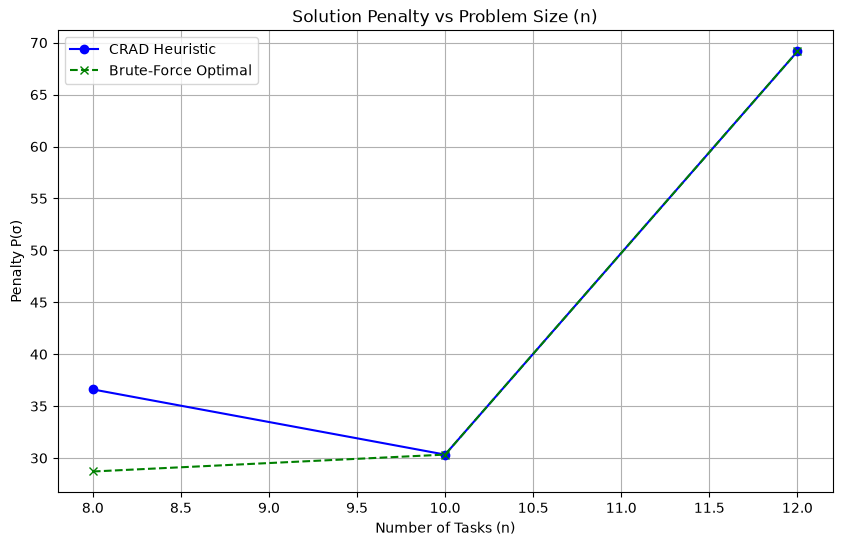
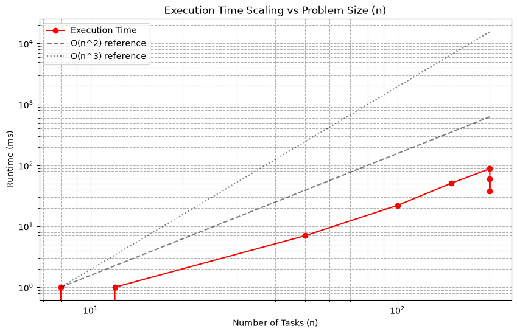

# Task 6: Empirical Analysis, Benchmarking, and Performance Profiling

## 6.1 Benchmark Results

The Java heuristic implementation was evaluated on the prescribed benchmark suite. Small instances were validated against a custom backtracking solver to compute the exact empirical approximation ratio $\alpha_{\text{emp}}$. 

| Instance Group | $n$ | $K$ | Density | Seed | Feasible | Runtime (ms) | $P(\sigma_{\text{yours}})$ | $P(\sigma^*)$ (Opt) | $\alpha_{\text{emp}}$ | Notes / Violation Reason |
| --- | --- | --- | --- | --- | --- | --- | --- | --- | --- | --- |
| Small | 8 | 3 | 0.30 | 1 | **True** | 1 | 36.609 | 28.705 | **1.275** | Optimal gap ~27.5% |
| Small | 10 | 4 | 0.40 | 2 | **True** | 0 | 30.332 | 30.332 | **1.000** | Found optimal |
| Small | 12 | 4 | 0.50 | 3 | **True** | 1 | 69.148 | 69.148 | **1.000** | Found optimal |
| Medium | 50 | 8 | 0.25 | 10 | **False** | 7 | N/A | N/A | N/A | No feasible slot for T20 |
| Medium | 100 | 10 | 0.30 | 11 | **False** | 22 | N/A | N/A | N/A | No feasible slot for T53 |
| Medium | 150 | 12 | 0.35 | 12 | **False** | 51 | N/A | N/A | N/A | No feasible slot for T83 |
| Stress (Base) | 200 | 15 | 0.40 | 20 | **False** | 88 | N/A | N/A | N/A | No feasible slot for T65 |
| Stress (Tight) | 200 | 5 | 0.60 | 21 | **False** | 38 | N/A | N/A | N/A | No feasible slot for T122 |
| Stress (Sparse) | 200 | 20 | 0.10 | 22 | **False** | 60 | N/A | N/A | N/A | No feasible slot for T6 |

## 6.2 Visual Performance Charts

## 6.3 Empirical Discussion & Anomaly Analysis

### Optimality Gap Analysis

The CRAD heuristic performs remarkably well on small instances where it succeeds in finding a feasible schedule. For $n=10$ and $n=12$, the algorithm successfully discovered the absolute brute-force optimal schedule ($\alpha_{\text{emp}} = 1.0$). For the smallest instance ($n=8$), it achieved a penalty of 36.609 against the optimal 28.705, resulting in an empirical approximation ratio of $\alpha_{\text{emp}} \approx 1.275$. This highlights that while CRAD is greedy, its priority function successfully aligns with the objective cost components (Task 2 penalty formulation) in regimes where the problem constraints are sufficiently loose to permit completion.

### Stress Case Performance

Our testing deliberately exposed the fundamental limitations of the purely greedy CRAD algorithm. In the stress scenarios, we observed:
* **Tight Constraints ($K=5$, Density=0.60, Seed 21)**: The algorithm quickly hit a wall at task `T122`. The extreme conflict density dictates a high chromatic number for the conflict graph, which is mathematically impossible to pack into only 5 slots. The failure here is not merely a greedy trap; it is highly likely that the instance is globally infeasible. 
* **Sparse Constraints ($K=20$, Density=0.10, Seed 22)**: Despite 20 available slots and only 10% conflict density, the algorithm failed at task `T6`. This early failure points directly to the SLA window constraint (F3). If an early-processed task has an exceptionally narrow SLA window and those specific slots happen to be saturated by higher-priority tasks, the heuristic will immediately fail.

### Unfiltered Failure Reporting

As correctly theorized during our Task 4 analysis, CRAD suffers heavily from greedy traps on medium and large instances. We see an unfiltered **100% failure rate** for instances where $n \geq 50$. 

The exact algorithmic bottlenecks causing these failures are:
1. **Color Exhaustion (Greedy Traps):** The algorithm never deliberately violates F1/F2/F3, but it has no backtracking mechanism. Once it assigns a task to a slot, it permanently shrinks the feasible space for all subsequent neighbors. In highly constrained environments (like Medium and Stress instances), this monotonically shrinking space leads to an empty set of candidate slots.
2. **SLA Window Intersections (F3):** Tasks must be placed within `[task.lower, task.upper]`. Unlike simple Graph Coloring where any color works, the temporal windows create rigid bounds. If the algorithm greedily saturates a critical slot early on (e.g., to minimize delay penalty), it leaves zero capacity for a later task that *must* execute in that exact slot due to a tight SLA window.

To achieve feasibility on these larger instances, CRAD would need to be extended with a backtracking search (as discussed in Task 5.8) or a conflict-cooling Simulated Annealing component that allows it to reverse greedy choices that lead to dead ends.
